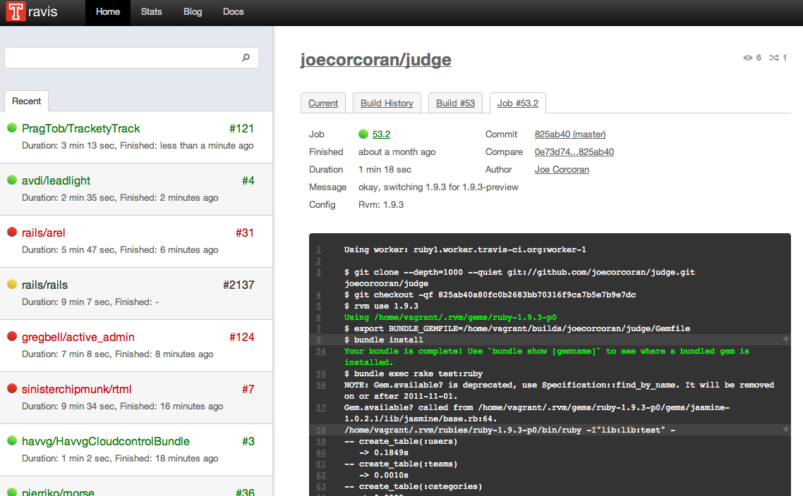

!SLIDE
# Judge
## Client-side form validation in Rails 3

!SLIDE
# Joe Corcoran
## Developer at Tribesports

!SLIDE bullets incremental small
# Existing options

* **livevalidation**
  <a href="http://livevalidation.com/">http://livevalidation.com/</a>
* **client\_side\_validations**
  <a href="http://github.com/bcardarella/client_side_validations">http://github.com/bcardarella/client\_side\_validations</a>

!SLIDE bullets incremental
# Project goals

* Simple interface
* Make no assumptions about your app
* Lightweight

!SLIDE 
# This is a simple job

!SLIDE
# HTML5 data attributes
    @@@ HTML
    

      Jair Ventura Filho
    

!SLIDE incremental bullets
## From <a href="http://developers.whatwg.org/elements.html#embedding-custom-non-visible-data-with-the-data-*-attributes">the WHATWG HTML5 Spec</a>...
* "Custom data attributes are intended to store custom data private to the page or application, *for which there are no more appropriate attributes or elements*"
* "These attributes are not intended for use by software that is independent of the site that uses the attributes"

!SLIDE
## Put that data-* attribute away, son...  You might hurt someone
<a href="http://danwebb.net/2010/1/27/put-that-data-attribute-away-son-you-might-hurt-someone">http://danwebb.net/2010/1/27/put-that-data-attribute-away-son-you-might-hurt-someone</a>

!SLIDE
    @@@ HTML
    <input 
      type="text" 
      name="user[name]" 
      data-validate="[{\"kind\":\"presence\"}]" 
    />

!SLIDE
    @@@ ruby
    ActionView::Helpers::FormBuilder

!SLIDE
    @@@ ruby
    <%= form_for(@user) do |f| %>
      <%= f.text_field :name %>
    <% end %>

!SLIDE
    @@@ ruby
    class MyAceFormBuilder < ActionView::Helpers::FormBuilder
      def text_field(method, options = {})
        @template.text_field(@object_name, method, options)
      end
    end

    <%= form_for(@user, :builder => MyAceFormBuilder) do |f| %>
*etc.*

!SLIDE small
## Cheeky
    @@@ ruby
    module ActionView::Helpers::FormHelper
      def form_for_new(record_or_name_or_array, *args, &proc)
        options = args.extract_options!
        options[:builder] ||= MyAceFormBuilder
        form_for_original(record_or_name_or_array, *(args << options), &proc)
      end
      alias_method :form_for_original, :form_for
      alias_method :form_for, :form_for_new
    end

!SLIDE small
    @@@ ruby
    class MyAceFormBuilder < ActionView::Helpers::FormBuilder
      def text_field(method, options = {})
        @template.content_tag(:div, :class => "wrapper") do
          @template.text_field(@object_name, method, options)
        end
      end
    end

!SLIDE smaller
    @@@ ruby
    class Judge::FormBuilder < ActionView::Helpers::FormBuilder
      def text_field(method, options = {})
        if options.delete(:validate).present?
          options = { 
            "data-validate" => Judge::ValidatorCollection.new(self.object, method).to_json 
          }.merge(options)
        end
        @template.text_field(self.object_name, method, options)
      end
    end

!SLIDE
    @@@ ruby
    # ActiveModel::Errors#generate_message
    @user.errors.generate_message(:name, :blank)

!SLIDE
## The error message lookup chain
    activemodel.errors.models.admin.attributes.title.blank

    activemodel.errors.models.admin.blank

    activemodel.errors.models.user.attributes.title.blank

    activemodel.errors.models.user.blank

    [default message you provided through the options hash]

    activemodel.errors.messages.blank

    errors.attributes.title.blank

    errors.messages.blank

!SLIDE
    @@@ ruby
    <%= form_for(@user, :builder => Judge::FormBuilder) do |f| %>
      <% f.text_field :name, :validate => true %>
    <% end %>

!SLIDE
    @@@ javascript
    $('#user_name').validate();

!SLIDE
    @@@ javascript
    var e = document.getElementById('user_name'),
        w = new judge.Watcher(e);
    w.validate();

!SLIDE
    @@@ javascript
    // convenience method
    judge.validate(document.getElementById('user_name'));

!SLIDE table
# WHAAAAAAAAAAAAAAAAAT
<table border="1" cellspacing="0" cellpadding="0">
<tbody>
<tr>
<th>  Method</td>
<th>  IE8 </td>
<th>  IE9 beta </td>
<th>  FireFox 4.0 beta </td>
<th>  Chrome 10.0 dev </td>
<th>  Safari 5.02 </td>
<th>  Opera 11 </td>
</tr>
<tr>
<td>  getElementsByTagName </td>
<td>

  HTMLCollection 

</td>
<td>

  HTMLCollection 

</td>
<td>

  HTMLCollection 

</td>
<td>

  NodeList 

</td>
<td>

  NodeList 

</td>
<td>

  NodeList 

</td>
</tr>
<tr>
<td>  getElementsByClassName </td>
<td>

  HTMLCollection 

</td>
<td>

  HTMLCollection 

</td>
<td>

  HTMLCollection 

</td>
<td>

  NodeList 

</td>
<td>

  NodeList 

</td>
<td>

  NodeList 

</td>
</tr>
<tr>
<td>  getElementsByName </td>
<td>

  HTMLCollection 

</td>
<td>

  HTMLCollection 

</td>
<td>

  HTMLCollection 

</td>
<td>

  NodeList 

</td>
<td>

  NodeList 

</td>
<td>

  NodeList 

</td>
</tr>
<tr>
<td>  querySelectorAll </td>
<td>  StaticNodeList </td>
<td>

  StaticNodeList 

</td>
<td>  NodeList (Static) </td>
<td>

  NodeList (Static) 

</td>
<td>

  NodeList (Static) 

</td>
<td>

  NodeList (Static) 

</td>
</tr>
<tr>
<td>  childNodes </td>
<td>  NodeList </td>
<td>

 NodeList 

</td>
<td>

  NodeList 

</td>
<td>

  NodeList 

</td>
<td>

  NodeList 

</td>
<td>

  NodeList 

</td>
</tr>
<tr>
<td>

  children 

</td>
<td>

  HTMLCollection 

</td>
<td>

  HTMLCollection 

</td>
<td>

  HTMLCollection 

</td>
<td>

  HTMLCollection 

</td>
<td>

  HTMLCollection 

</td>
<td>

  HTMLCollection 

</td>
</tr>
<tr>
<td>

  document.links 

</td>
<td>

  HTMLCollection 

</td>
<td>

  HTMLCollection 

</td>
<td>

  HTMLCollection 

</td>
<td>

  HTMLCollection 

</td>
<td>

 HTMLCollection 

</td>
<td>

  HTMLCollection 

</td>
</tr>
<tr>
<td>  document.images </td>
<td>

  HTMLCollection 

</td>
<td>

  HTMLCollection 

</td>
<td>

  HTMLCollection 

</td>
<td>

  HTMLCollection 

</td>
<td>

  HTMLCollection 

</td>
<td>

  HTMLCollection 

</td>
</tr>
<tr>
<td>  document.anchors </td>
<td>

  HTMLCollection 

</td>
<td>

  HTMLCollection 

</td>
<td>

  HTMLCollection 

</td>
<td>

  HTMLCollection 

</td>
<td>

  HTMLCollection 

</td>
<td>

  HTMLCollection 

</td>
</tr>
<tr>
<td>  document.forms </td>
<td>

  HTMLCollection 

</td>
<td>

  HTMLCollection 

</td>
<td>

  HTMLCollection 

</td>
<td>

  HTMLCollection 

</td>
<td>

  HTMLCollection 

</td>
<td>

  HTMLCollection 

</td>
</tr>
<tr>
<td>  document.applets </td>
<td>

  HTMLCollection 

</td>
<td>

  HTMLCollection 

</td>
<td>

  HTMLCollection 

</td>
<td>

  HTMLCollection 

</td>
<td>

  HTMLCollection 

</td>
<td>

  HTMLCollection 

</td>
</tr>
<tr>
<td>  formElement.elements </td>
<td>

  HTMLFormElement 

</td>
<td>

 HTMLCollection 

</td>
<td>

  HTMLCollection 

</td>
<td>

  HTMLCollection 

</td>
<td>

  HTMLCollection 

</td>
<td>

  HTMLCollection 

</td>
</tr>
<tr>
<td>  selectElement.options </td>
<td>

  HTMLSelectElement 

</td>
<td>

  HTMLSelectElement 

</td>
<td>

  HTMLOptionsCollection 

</td>
<td>

  HTMLOptionsCollection 

</td>
<td>

  HTMLOptionsCollection 

</td>
<td>

  HTMLOptionsCollection 

</td>
</tr>
<tr>
<td>  tableElement.rows </td>
<td>

  HTMLCollection 

</td>
<td>

  HTMLCollection 

</td>
<td>

 HTMLCollection 

</td>
<td>

  HTMLCollection 

</td>
<td>

  HTMLCollection 

</td>
<td>

  HTMLCollection 

</td>
</tr>
<tr>
<td>  rowElement.cells </td>
<td>

  HTMLCollection 

</td>
<td>

  HTMLCollection 

</td>
<td>

  HTMLCollection 

</td>
<td>

  HTMLCollection 

</td>
<td>

  HTMLCollection 

</td>
<td>

  HTMLCollection 

</td>
</tr>
<tr>
<td>  document.all </td>
<td>

  HTMLCollection 

</td>
<td>

  HTMLCollection 

</td>
<td>

  object HTML document.all class 

</td>
<td>

  HTMLAllCollection 

</td>
<td>

 HTMLAllCollection 

</td>
<td>

  HTMLCollection 

</td>
</tr>
</tbody>
</table>

!SLIDE smaller
# Using jQuery
    @@@ javascript
    $('form#user input[type=text]').keyup(function() {
      var inputs = $(this).get();
      console.log(judge.validate(inputs));
    });

    // => [{ valid:true, messages:[], element:HTMLInputElement },
    //     { valid:false, messages:['must be even'], element:HTMLInputElement }]

!SLIDE
# In a nutshell
    @@@ ruby
    # view
    <%= form_for(@user, :builder => Judge::FormBuilder) do |f| %>
      <% f.text_field :name, :validate => true %>
    <% end %>

    @@@ javascript
    // client side
    judge.validate(document.getElementById('user_name'));

!SLIDE
# Travis CI
(A brief shoutout)

<a href="http://travis-ci.org">http://travis-ci.org</a>

!SLIDE center

!SLIDE
## .travis.yml

    rvm:
      - 1.9.2
      - 1.9.3

    script: "bundle exec rake test:ruby"

    notifications:
      recipients:
        - joe@tribesports.com

    branches:
      only:
        - master

!SLIDE
# Thank you

<a href="http://github.com/joecorcoran/judge">http://github.com/joecorcoran/judge</a>

<a href="http://judge.joecorcoran.co.uk/">http://judge.joecorcoran.co.uk/</a>

!SLIDE center

## We're hiring!
